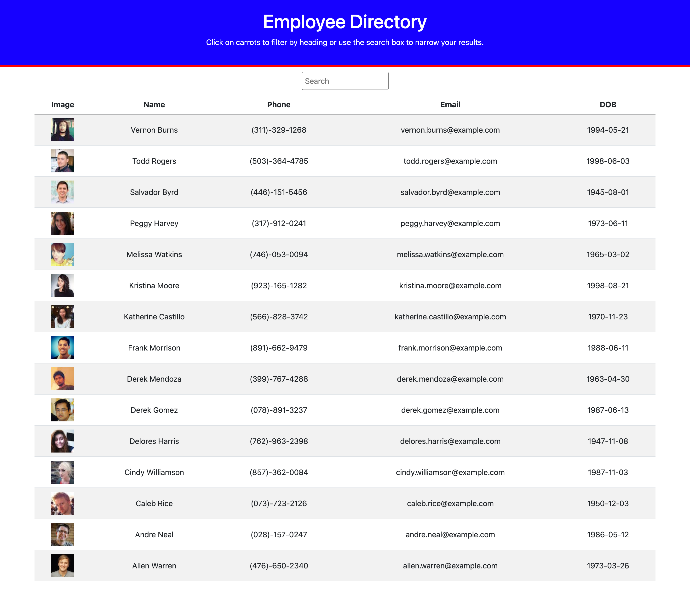

# React Employee Directory

# Description
This is an application built using React. It allows the user to view an entire employee directory at once to have quick access to their information. It allows you to filter employees by their names, and allows you to sort the table from A-Z and Z-A. 

[Employee Directory](https://bennsantos20.github.io/employee-directory/)

